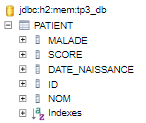
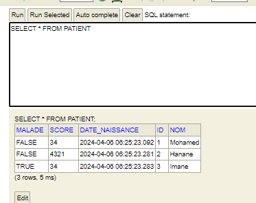
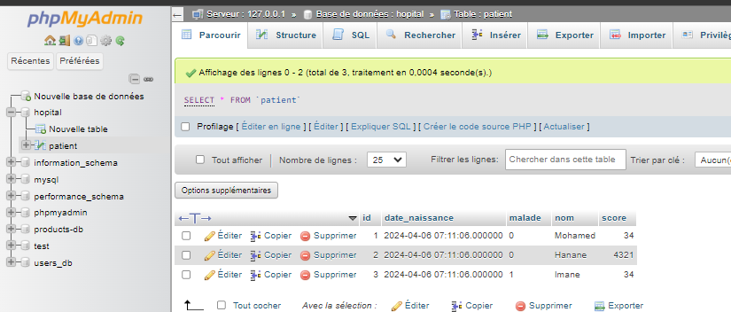
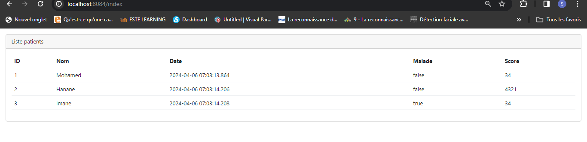
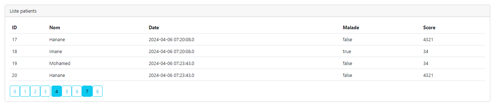
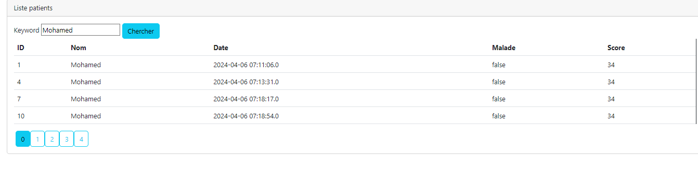
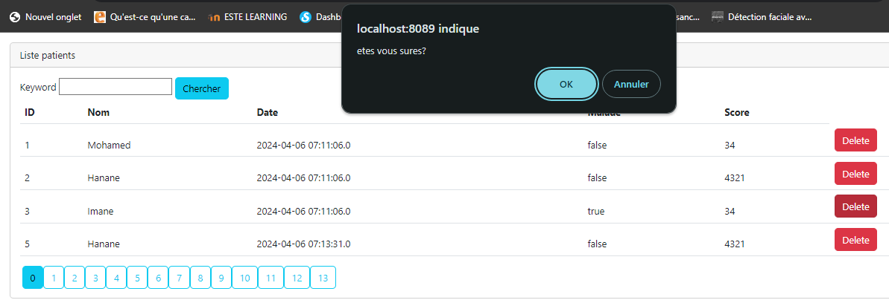
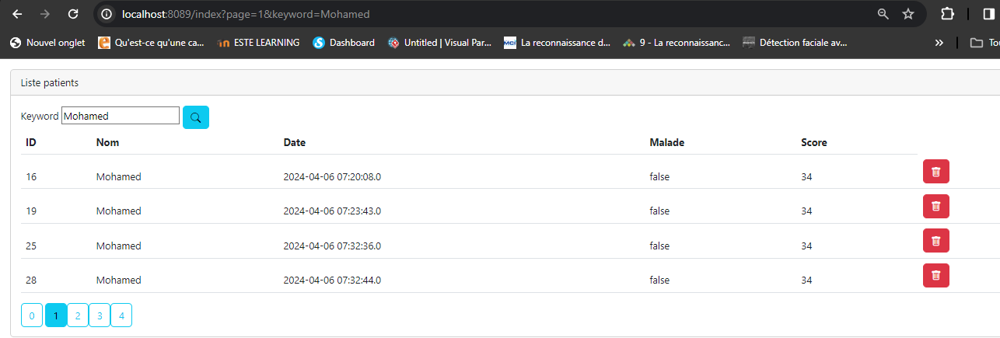

<h1>Compte rendu de l'activité Pratique N° 3  : Activité Pratique N°3 - Spring MVC  Partie1</h1>
Grami salma 
<h3>Introduction</h3>

L'Activité Pratique N°3 - Spring MVC se concentre sur le développement de fonctionnalités essentielles pour la gestion des patients dans un système de santé utilisant le framework Spring. Ce travail pratique explore quatre aspects clés : l'affichage des patients, la pagination pour une navigation fluide à travers les données, la possibilité de supprimer des patients du système, et enfin, la recherche de patients par leur nom pour une accessibilité accrue des informations. 

 
<h3>Enonce</h3>
Créer une application Web JEE basée sur Spring MVC, Thylemeaf et Spring Data JPA qui permet de gérer les patients. L'application doit permettre les fonctionnalités suivantes : 
<li>Afficher les patients
<li>Faire la pagination
<li>Chercher les patients
<li>Supprimer un patient
<li>Faire des améliorations supplémentaires(icons...)

<h3>Captures ecran </h3>

Créer l'entite Patient  dans H2 

 
 

Creation de la table Patient avec quelques donnees 

  
Migration vers Mysql

  
<h2>Affichage des Patients :</h2>

<h3>Contrôleur (PatientController) :</h3>

Dans la méthode <code>index</code>, le contrôleur récupère les informations des patients en utilisant la méthode <code>findByNomContains</code> du <code>PatientRepository</code>. Les informations sont paginées en utilisant <code>PageRequest.of(page, size)</code>, où <code>page</code> est le numéro de la page et <code>size</code> est la taille de la page. Les données récupérées sont ensuite stockées dans le modèle (<code>Model</code>) sous le nom <code>ListPatients</code>.

<h3>Vue (Patient.html) :</h3>

Les données des patients sont affichées dans un tableau à l'aide d'une boucle <code>th:each</code>. Les détails de chaque patient, tels que l'ID, le nom, la date de naissance, l'état de maladie et le score, sont affichés dans les cellules correspondantes du tableau.

  
<h2>Pagination :</h2>

  
<h3>Contrôleur (PatientController) :</h3>

La pagination est gérée en récupérant une page spécifique de patients à afficher à partir de la méthode <code>findByNomContains</code> avec les informations de pagination. Les informations de pagination, telles que le nombre total de pages et la page actuelle, sont également ajoutées au modèle.

 
<h2>Recherche de Patient par Nom :</h2>

<h3>Contrôleur (PatientController) :</h3>

La recherche est effectuée en utilisant le paramètre <code>kw</code> (keyword) passé dans l'URL. La méthode <code>findByNomContains</code> du <code>PatientRepository</code> est utilisée pour récupérer les patients correspondants en fonction du nom saisi.

<h3>Vue (Patient.html) :</h3>

Un champ de recherche est affiché où l'utilisateur peut saisir le nom du patient à rechercher. Lorsque l'utilisateur soumet le formulaire de recherche, la page est rechargée avec le mot-clé de recherche passé dans l'URL, ce qui déclenche une nouvelle recherche de patients correspondants.

  

<h2>Suppression de Patient :</h2>

<h3>Contrôleur (PatientController) :</h3>

Lorsque l'utilisateur clique sur le bouton de suppression à côté d'un patient, la méthode <code>delete</code> est appelée dans le contrôleur. La méthode <code>delete</code> supprime le patient correspondant en utilisant l'ID du patient et redirige vers la page d'index avec les paramètres de pagination et de recherche.

<h3>Vue (Patient.html) :</h3>

À côté de chaque patient, un bouton de suppression est affiché, qui appelle la méthode de suppression du contrôleur en passant l'ID du patient, le mot-clé de recherche et le numéro de page actuel.

  
<h2>Ajout des icones de bootstrap</h2>

 
<h3>Conclusion</h3>
 

En conclusion, l'Activité Pratique N°3 - Spring MVC démontre la capacité du framework Spring à développer des fonctionnalités avancées pour la gestion des patients. 
